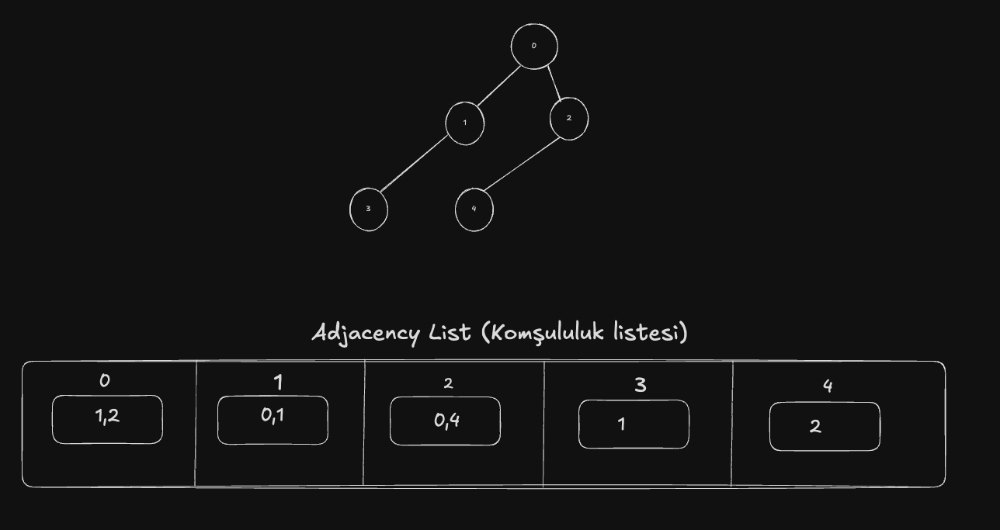

# Graph (Graf)

A Graph (Graf) is a data structure (veri yapısı) consisting of Nodes (Düğümler) (often also called vertices) and Edges (Kenarlar) connecting these nodes. Graphs are incredibly useful in modeling relationships where elements are connected in various ways, such as roads between cities, friends on social networks, or links between web pages.

## Types of Graphs (Graf Türleri)

### 1. Undirected Graph (Yönlendirilmemiş Graf)
* Each Edge (Kenar) connects two Nodes (Düğümler) in both directions
* Example in real life: A bidirectional road between two cities

### 2. Directed Graph (Yönlendirilmiş Graf)
* Each Edge (Kenar) has a direction, going from one Node (Düğüm) to another
* Example in real life: One-way streets or a Twitter "following" relationship

### 3. Weighted Graph (Ağırlıklı Graf)
* Each Edge (Kenar) has an associated cost or weight, often used to represent distance, capacity, or other metrics
* Example: A road network where each road has a length or travel time

### 4. Unweighted Graph (Ağırlıksız Graf)
* No weights (costs) are associated with the Edges (Kenarlar); edges are treated equally

## Graph Representations (Graf Temsilleri)

### 1. Adjacency Matrix (Komşuluk Matrisi)
* A 2D array (matrix) where the rows and columns represent Nodes (Düğümler)
* An entry at [i][j] is 1 (or true) if there is an edge from node i to node j; otherwise 0 (or false)

**Pros:**
* Good for dense graphs (a lot of connections)
* Fast to check if an edge exists between two nodes

**Cons:**
* Can be memory-intensive for sparse graphs
* Adding or removing edges can be costlier than in other structures

### 2. Adjacency List (Komşuluk Listesi)
* Each Node (Düğüm) has a list of its adjacent neighbors (the nodes it has edges to)
* Often implemented with an ArrayList of LinkedLists (or another list structure)

**Pros:**
* Uses memory proportional to the number of Nodes (Düğümler) plus the number of Edges (Kenarlar)
* Efficient for sparse graphs

**Cons:**
* Not as quick to check if there is a direct edge between two nodes (requires traversing the adjacency list)

### 3. Adjacency Set (Komşuluk Kümesi)
* Similar to an adjacency list, but each Node (Düğüm) keeps a Set (Küme) of neighbors instead of a list

**Pros:**
* Checking existence of an edge can be faster (constant time in a HashSet)

**Cons:**
* Slightly higher overhead in memory compared to a plain list for small graphs

*(There are other representations like Incidence Matrix, but the above three are the most commonly used.)*

	1.	The outer list (dış liste): represents the Nodes (Düğümler).
	2.	The inner lists (iç listeler): represent the neighbors (bağlı Düğümler) of each node.

